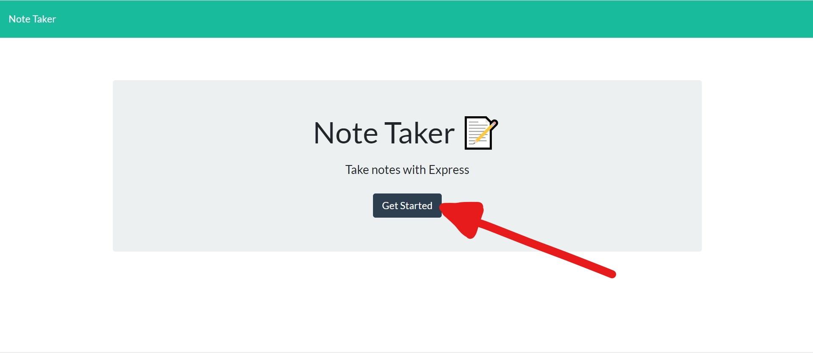
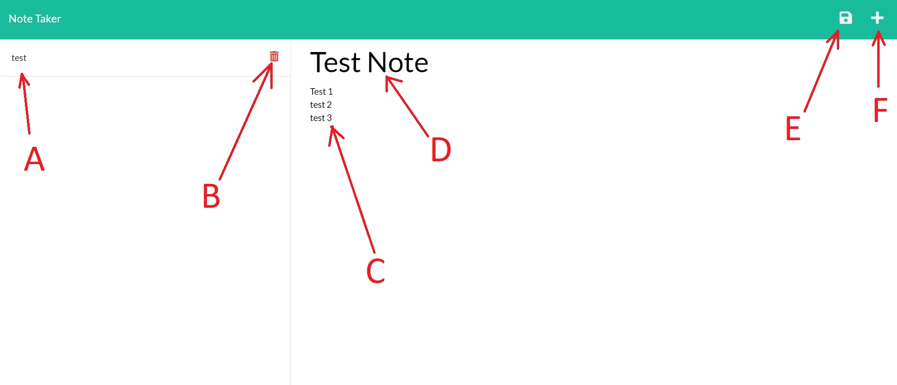

worked with Chuck, William, Damien, Brian, Ethan 10/21/21

#  **Note Taker** 

    

### **Navigation**

[Description](#description)

[Screenshots](#screenshots)

[Questions](#questions)

[Installation](#installation)

[Testing](#testing)

[Contact-me](#contact-me)

[Ideas-for-improvement](#ideas-for-improvement)

-------

## **Description** 
A persistent server based scheduling assistant with note creation and note deletion capabilities. 

--------

https://watch.screencastify.com/v/ebeCgPNv81ITMhh6mmjx

---------

## **Screenshots:**

---------------

A: Note Storage

B: Click to delete a note

C: New note body

D: New note text

E: click to save note

F: click to reset new note to blank

-------

## **Questions:**

### **What licenses are needed?**
NPM, Express

### **Installation**
npm -i

### **Testing** 
There are no tests

### **Will it be maintained?** 
it will not be maintained

### **Can I contribute?** 
You cannot contribute

   

--------

## **Contact me:**
### https://github.com/VookmirVookmir

----------

## **Ideas for improvement:**

